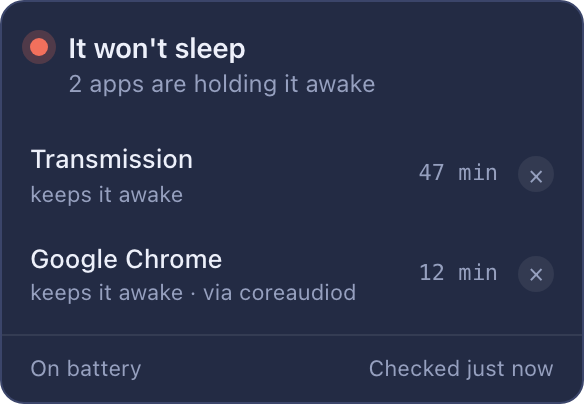

# Nod

**Will the Mac fall asleep if you walk away right now?**

Sometimes a Mac quietly stops sleeping. You leave, assuming it dozed off, and
five hours later it is flat. Nod tells you before that happens: three Z's in the
menu bar. Green, it will sleep. Red, something is holding it.

## Install

**[Download for Apple Silicon](https://github.com/olegperegudov/nod/releases/latest/download/Nod_macOS_AppleSilicon.dmg)** · **[Download for Intel](https://github.com/olegperegudov/nod/releases/latest/download/Nod_macOS_Intel.dmg)**

Open the disk image, drag Nod into Applications. The first launch is where
macOS gets in the way: it says it cannot verify the app and offers to put it in
the Trash. Nothing is wrong with the file. Apple vouches only for developers who
pay it $99 a year; this app is free, so it gets the scary dialog instead.

Press **Done** — never *Move to Trash*. Then open **System Settings → Privacy &
Security**, scroll to *Security*, and press **Open Anyway**.

That is once per app, not per version — updates after that install themselves.
Then allow notifications: that is how Nod warns you when you unplug the charger.

## Using it

You don't. You glance at the colour on your way out.

Red: click the icon to see who. The cross closes that app, the same way ⌘Q does.

On the charger the icon goes grey. A plugged-in Mac stays awake on purpose, so
long jobs can finish — nothing to warn about.

## What's inside

Nothing leaves the Mac: no account, no analytics, no network at all except the
update check. Nothing is stored either. Nod reads what the system command
`pmset` already prints and puts it in plain words — `pmset` names background
services, Nod names the apps.

macOS only. Windows has a similar command, but it needs an administrator
prompt, which is too much for a small icon in the corner.

When a new version is out the icon grows a green dot. Right-click → update.

How it works inside: [docs/DEVELOPMENT.md](docs/DEVELOPMENT.md). MIT licence.
