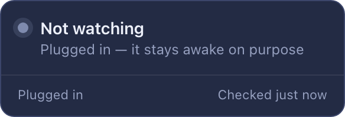

# Nod

**Will the Mac fall asleep when you walk away?**

Free and open source · Reads nothing but the power state · Lives in the menu bar

## Get it

### [⬇ Download for Apple Silicon](https://github.com/olegperegudov/nod/releases/latest/download/Nod_macOS_AppleSilicon.dmg) · [⬇ Download for Intel](https://github.com/olegperegudov/nod/releases/latest/download/Nod_macOS_Intel.dmg)

Need an older build? [All releases](https://github.com/olegperegudov/nod/releases)

## Three steps

1. **Open it.** macOS blocks unsigned apps on first launch: right-click the app → **Open**, or run
   `xattr -dr com.apple.quarantine /Applications/Nod.app`
2. **Allow notifications** when asked — that is how Nod warns you the moment you unplug.
3. **Walk away.** The three Z's in the menu bar are green when the Mac will sleep and red when it won't.

## It answers before you leave, not after

Green means nothing is holding the machine awake: shut the lid, it sleeps.

## Red names the app, not the machinery

macOS reports that "coreaudiod" is holding the speakers. That is the audio
service doing it *for* someone — Nod shows the app that actually took them.

## The cross closes the app

One click quits the holder the same way ⌘Q does, so it saves its work on the way
out. The verdict goes green as soon as it lets go.

## Plugged in, it keeps quiet

A Mac on power is meant to stay awake so long jobs can finish. Nod says so
instead of calling it a fault.

## Updates

The Z's grow a green dot when a new version is out. Right-click the icon →
**Update to vX.Y.Z**.

## Privacy

- Nothing leaves the Mac. No accounts, no analytics, no network calls except the update check.
- Nothing is stored: no history, no settings file. The debug log records events, never what you were doing, and starts empty on every launch.
- The only thing Nod reads is what `pmset` already prints for anyone on the machine.

## Under the hood

Stack, local build, tests and CI: [docs/DEVELOPMENT.md](docs/DEVELOPMENT.md).

## License

MIT
